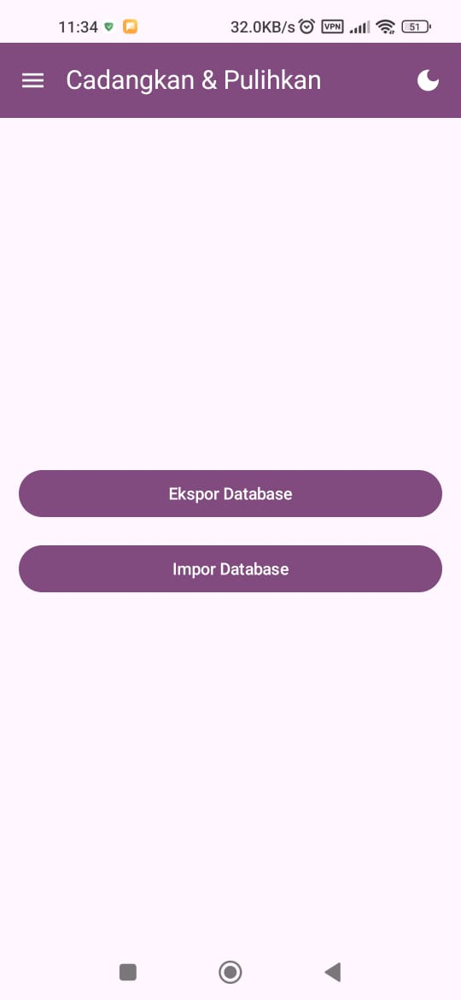

# Expense Tracker

An Android application for tracking daily expenses, built with modern Android development tools. This project was developed as part of the University's KKN (Kuliah Kerja Nyata) requirements.

---

## 🚀 Features

- **Expense Input:** Record expenses with a name, amount, and a custom date via a date picker.
- **Monthly View:** View and filter expenses by month and year.
- **Yearly Summary:** Get an overview of spending with a dedicated summary screen displaying total and average expenses per year.
- **Data Persistence:** All expense data is securely stored locally on the device using the Room Persistence Library.
- **Backup & Restore:** Easily export the database file to your device's storage for backup and import a previous backup.
- **Theming:** Toggle between light and dark mode with a persistent preference saved using Jetpack DataStore.

---

## 🛠️ Technologies Used

- **Jetpack Compose:** The modern Android UI toolkit.
- **Kotlin:** The primary programming language.
- **Room:** An abstraction layer over SQLite for local database persistence.
- **Kotlin Coroutines & Flow:** For asynchronous and reactive data handling.
- **Jetpack DataStore:** For saving user preferences (e.g., theme settings).

---

## 🖼️ Screenshots

---

## 📋 To Do

- **Search Functionality:** Add a search bar to the "View Expenses" screen to allow users to search for specific expenses.
- **Date Picker Improvements:** Persist the selected date in the input screen after an expense has been added, instead of resetting to the current date.
- **Code Documentation:** Add more comments and documentation to key functions and classes for clarity.

---

## ⚠️ Important Note for Debugging

Due to the use of a local database and Room's schema validation, it is highly recommended to **uninstall the app** from your device or emulator when making changes to the database schema (e.g., adding a new column to the `Expense` entity). This will ensure the old database file is deleted and a new one is created correctly on the next run.
